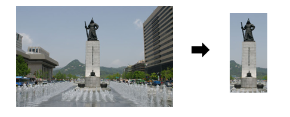
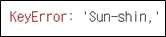

# APOKIA(**A** **P**icture **O**f **K**orea **I**n **A**ngle)

## 1. 소개
---
**APOKIA**(아포키아)는 외국인들이 한국형 사물 이미지에 담긴 정보에 쉽게 접근할 수 있도록 돕기 위해 고안된 아이디어입니다. 이를 위해 아포키아는 디바이스 내 한국형 사물 이미지를 인식하여, 얻어낸 정보를 각국 언어에 맞게 번역하여 제공합니다.

## 2. 서비스 절차
---
1. 갤러리에서 불러낸 이미지 내 사물을 box로 드래그한 후, 이미지와 box 위치를 입력합니다.

	

2. Image Recognition Model을 통해 레이블(사물 이름)을 출력한 후, 각 레이블에 대한 정보가 담긴 json 파일에서 해당 레이블 정보를 가져옵니다.

	

3. 추출한 해당 레이블 정보를 한-영 번역 모델을 통해 영어로 번역하고, 필요에 따라 영어를 타 언어로 번역하여 정보를 제공합니다. (아래 구현의 경우 '한국어-영어-러시아어' 구조로 이중 번역을 수행했습니다.)

	

## 3. Image Recognition Model
---
1. Dataset
- Source: [AI Hub](https://aihub.or.kr/) 한국형 사물 이미지 - 랜드마크

- 국내 30개 랜드마크에 대한 이미지 30,000장 (각 랜드마크마다 1,000장)

	

- 각 이미지에 대한 정보가 담긴 json 파일 30,000개

	

2. Preprocessing
- json 파일에서 이미지 내 사물 위치를 가리키는 box size를 찾은 후 사물만 남도록 이미지들을 자릅니다.

	

- 자른 이미지들을 같은 사이즈로 조정(resize=(150, 150))하고, 정규화(rescale=1./255)한 뒤, '이미지-사물(고유 번호)'로 라벨링합니다.

	

- 라벨링된 데이터들을 train set(50%), validation set(25%), test set(25%)으로 나눕니다.

3. Train
- keras에서 사전학습된 VGG16 모델 위에 완전연결층 3개와 드롭아웃층 2개를 이어 붙인 후 마지막 완전연결층에서 softmax 연산과 손실 함수로 분류 태스크를 학습 및 검증합니다.

	

- VGG16의 파라미터들은 동결시킨 채, Adam optimizer로 나머지 연결층의 파라미터들을 epoch마다 갱신합니다.

|주요 파라미터|입력값|
|:-:|:-:|
|**Input Shape**|(150, 150, 3)|
|**Dense unit**|512|
|**Dense activation function**|relu|
|**last Dense activation function**|softmax|
|**Drop out ratio**|0.5|
|**Loss function**|Categorical crossentropy|
|**optimizer**|Adam|
|**metrics**|accuracy|
|**Train steps**|350|
|**Validation steps**|175|
|**epochs**|15|

4. 학습 결과
- GPU(Tesla V100-SXM2 32G)로 약 10시간 학습한 결과, test set 기준 **88.9**%의 정확도를 보였습니다.

	

- 드롭아웃층으로 학습데이터 과적합을 규제했음에도 불구하고, 상대적으로 작은 데이터를 학습한 탓에 validation loss(실선)가 training loss(점)보다 불안정했습니다.

5. 예측 및 평가

	

>일부 잘린 사진과 야간 촬영 사진에서도 높은 정확도를 보였습니다.**(e.g., 롯데월드타워)**

## 4. KO-EN Translation Model
---
1. Dataset

- Source: [AI Hub](https://aihub.or.kr/) 한-영 번역 말뭉치 - 뉴스, 한국문화, 지자체 웹사이트  

	

- 데이터셋에서 원문과 번역문 내 단어 개수가 32개 이하인 617,101개의 문장들을 추출했습니다.

2. Preprocessing
- 엑셀 파일에서 각 인덱스의 원문과 번역문을 가져와 쌍을 만들어 리스트로 저장합니다.

- 특수기호를 없애는 클렌징 작업 후 문장 내 단어들을 사전에 저장합니다.

- 617,101쌍의 문장을 분석한 결과, 한국어 사전에 1,004,153개의 단어들이 저장되었으며, 영어 사전에 202,293개의 단어들이 저장되었습니다.

3. Train
- GRU 기반 Seq2seq 모델에서 Encoder의 출력 은닉벡터를 참조할 수 있는 Attention layer를 추가했습니다. 

	

- 문장 처음을 뜻하는 기호 ‘<SOS>’를 입력으로 받은 decoder가 softmax 연산에 기반하여 순서대로 단어를 하나씩 생성할 수 있도록 학습합니다.

- SGD optimizer로 매 epoch마다 갱신합니다.

|주요 파라미터|입력값|
|:-:|:-:|
|**Max sentence length**|64|
|**GRU hidden vector size**|512|
|**Encoder activation functionn**|relu, softmax|
|**Decoder activation function**|relu, log softmax|
|**Attention activation functionn**|relu|
|**Drop out ratio**|0.1|
|**optimizer**|SGD|
|**epochs**|200,000|
|**Loss function**|negative log likelihood loss|

4. 학습 결과
- GPU(Tesla V100-SXM2 32G)로 약 17시간 학습했으며, 약 160,000 epoch 이후 갱신 추이가 완만해졌습니다.

	

5. 예측 및 평가
- 한빛탑

**Query:** 대한민국 최초의 공인 엑스포로 열린 1993년 세계 박람회를 기념하기 위해 세워진 상징 조형물

**네이버 파파고:** Symbolic sculpture built to commemorate the 1993 World Expo held at the first official Expo in Korea

**Model output:** The worlds first Korean Chinese restaurant in Korea was held in the worlds fourth event in Korea with the worlds largest in the world <_EOS>

- 이순신장군동상

**Query:** 대한민국 서울특별시 종로구 사직로 광화문 광장에 위치한 이순신 장군의 동상

**네이버 파파고:** Statue of Admiral Yi Sun-shin, located in Gwanghwamun Square, Sajik-ro, Jongno-gu, South Korea

**Model output:** The policy of the Korean Peninsula of the Korean Peninsula which was announced to the public is a public opinion saying The public is not the public opinion of the public the public is not the private company is also a public opinion

- 남산타워

**Query:** 대한민국 서울특별시 용산구 용산동 2가 남산 공원 정상 부근에 위치한 전파 송출 및 관광용 타워

**네이버 파파고:** Radio transmission and tourism tower located near the top of Namsan Park on Yongsan-dong 2-ga, Yongsan-gu, Seoul, Korea

**Model output:** The number of the elderly the two Koreas have been the number of the elderly in the market to be the most competitive site in the market <_EOS>

>랜덤 초기화된 embedding으로 학습을 진행하여 hidden parameter와 attention weight
가 올바르게 개선되지 않았습니다. 따라서 추후 사전학습된 Embedding Layer와 더 많은 GRU 
Layer를 활용하여 개선할 예정입니다.

## 5. EN-RU Translation Model
---

1. Dataset

- Source: [WMT18](http://www.statmt.org/wmt18/translation-task.html/) News Commentary v13(RU-EN)

- 러-영 쌍으로 이루어진 뉴스 해설 말뭉치에서 원문과 번역문 내 단어 개수가 32개 이하인 171,432개의 문장들을 추출했습니다.

2. Preprocessing

- 텍스트 파일에서 영어 문장과 러시아어 문장을 가져와 쌍을 만들어 리스트로 저장합니다.

- 특수기호를 없애는 클렌징 작업 후 문장 내 단어들을 사전에 저장합니다.

- 171,432쌍의 문장을 분석한 결과, 영어 사전에 75,901개의 단어들이 저장되었으며, 러시아어 사전에 162,564개의 단어들이 저장되었습니다.

3. Train

- 한국어–영어 번역 모델과 같은 방식으로 학습하되, epoch 수는 100,000으로 조정했습니다.

4. 학습 결과

- Colab GPU로 약 9시간 학습했으며, 한국어-영어 번역 모델과 비슷한 경과를 보였습니다.

	

5. 예측 및 평가

- 한빛탑

**Query:** Symbolic sculpture built to commemorate the 1993 World Expo held 
at the first official Expo in Korea

(대한민국 내 첫 공식 엑스포에서 열린 1993년도 세계 엑스포를 기념하기 위해 세워진 상징 조형물)

**네이버 파파고:** Символьные скульптуры построенные в память о проведении первой мировой выставки 1993 года.

(1993년도 첫 세계 박람회 실현을 기념하기 위해 세워진 상징적인 조형물)

**Model output:** В случае с Турцией в США в случае с 1991 года в течение нескольких месяцев в то время как Япония в значительной степени в состоянии противостоять в качестве одного из самых важных <_EOS>

(1991년 이후 몇 달 동안 터키의 경우 미국에서 일본은 가장 중요한 것 중 하나로 맞설 능력이 높다.)

- 이순신장군동상

**Query:** Statue of Admiral Yi Sun-shin, located in Gwanghwamun Square, Sajik-ro, Jongno-gu, South Korea

(대한민국 종로구 사직로 광화문 광장에 위치한 이순신 장군의 동상)

**네이버 파파고:** В военное время статуя генерала Ли Сунсина находится на площади Кванхвамун. Чонги, Южная Корея.

(전시에 이순신 장군의 동상이 대한민국 광화문 광장에 위치하고 있다.)

**Model output:** 문장 내 아래 단어가 학습되지 않아 문장을 생성하지 못했습니다.

	

- 남산타워

**Query:** Radio transmission and tourism tower located near the top of Namsan Park on Yongsan-dong 2-ga, Yongsan-gu, Seoul, Korea

(대한민국 서울 용산구 용산동 2가에 있는 남산 공원 정상 가까이에 위치한 라디오 송출 및 관광타워)

**네이버 파파고:** Общественная электроэнергетическая башня 2 Енсан-дон в Ёнсан-гу, Сеул=== Элемент, включённый в список Национального парка Намсан ==="Южныйсан"

(서울 용산구 용산동2의 공중 전기탑 === 국립 남산 공원 목록에 포함된 요소다.)

**Model output:** 문장 내 아래 단어가 학습되지 않아 문장을 생성하지 못했습니다.

	

>한국어-영어 번역 모델과 마찬가지로, pretrained embedding layer와 복수 층의 GRU  layer를 추가하여 학습을 개선할 예정입니다.

>러시아어-영어 말뭉치 내 한국어 고유 단어가 없어 이중 번역 태스크를 원활히 수행하지 못했습니다. 그러나 추후 한국어-러시아어 말뭉치로 학습할 수 있다면 손쉽게 해결할 수 있을 것으로 보입니다.